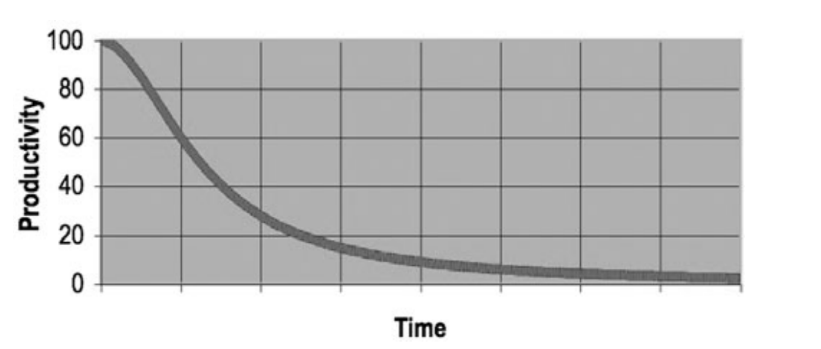

# Chapter 1 - Clean Code

This is a book about good programming. We are going to look at code from every different direction.

We’ll know how to write good code. And we’ll know how to transform bad code into
good code.

### The Total Cost of Owning a Mess

If you have been a programmer for more than two or three years, you have probably been
significantly slowed down by someone else’s messy code.

As the mess builds, the productivity of the team continues to decrease, asymptotically
approaching zero.

### What Is Clean Code?

<b>Bjarne Stroustrup</b>, inventor of C++

> Clean code does one thing well.

<b>Dave Thomas</b>, founder of OTI

> Clean code can be read, and enhanced by a developer
other than its original author. It has unit and acceptance tests.

<b>Michael Feathers</b>, author of Working Effectively with Legacy Code

> Clean code always looks like it was written by someone who cares.
> if you try to imagine improvements, you’re led back to where you are.

<b>Ward Cunningham</b>, inventor of Wiki

> You can call it beautiful code when the code also 
makes it look like the language was made for the problem.

It is not the language that makes programs appear simple, it is the programmer that make the language appear simple!

We want the reading of code to be easy, even if it makes the writing harder.

### The Boy Scout Rule

It’s not enough to write the code well. The code has to be <b><i>kept clean</i></b> over time.

The cleanup doesn’t have to be something big.

Change one variable name for the better, break up one function that’s a little too large, 
eliminate one small bit of duplication, clean up one composite if statement.